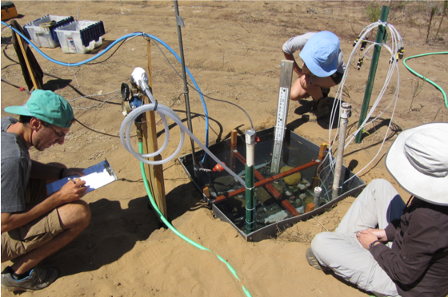
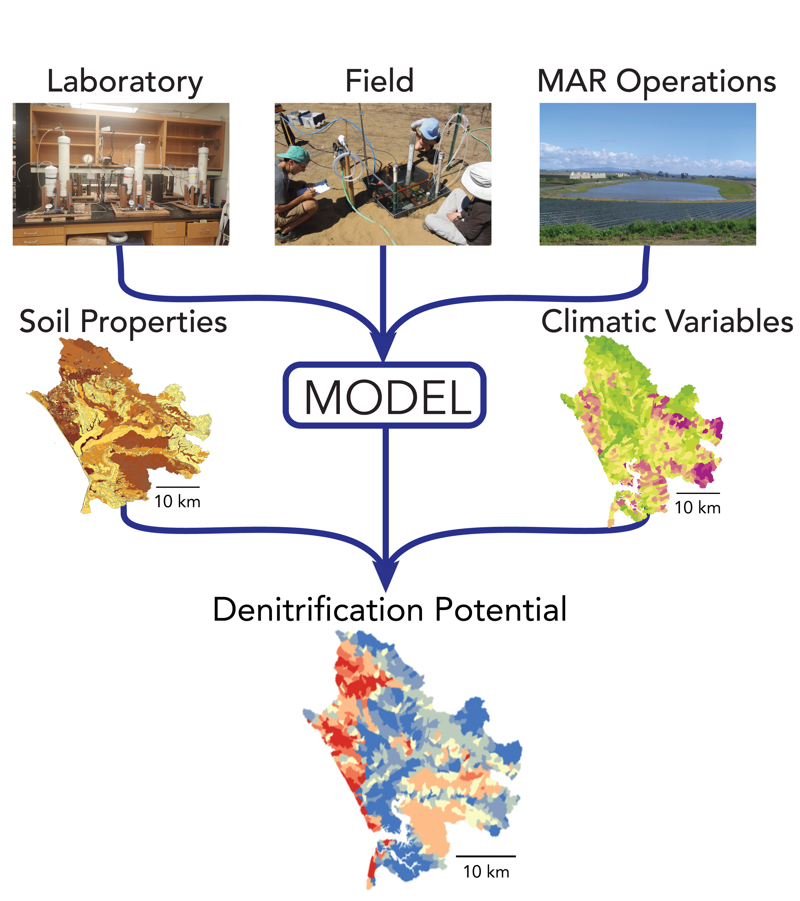
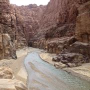

 
 
 
 

# Research
 
 
 
 
 
 
 

---
### Measuring denitrification during managed aquifer recharge

##### Managed aquifer recharge (MAR) is a common technique for augmenting groundwater supplies, but it is important to ensure that the water used for infiltration doesn't harm ambient groundwater quality. Under certain conditions, contaminants such as nitrate (NO~3~) can be removed as water infiltrates through shallow soils during MAR via a process called denitrification. Through lab, field, and modeling studies we are investigating how controlling factors such as infiltration rate and the amount of labile carbon can affect denitrification during infiltration. 

 
 

**Gorski G.**, Fisher A.T., Beganskas S., Weir W., Redford K., Schmidt C., Saltikov C. (2019) Field and laboratory studies linking hydrologic, geochemical, and microbiological processes and enhanced denitrification during infiltration for managed recharge. *Environmental Science and Technology* [[_pdf_](files/Gorski_EST_2019.pdf)]
[[_link_](https://pubs.acs.org/doi/10.1021/acs.est.9b01191)]

Beganskas S., **Gorski G.**,Weathers T., Fisher A.T., Schmidt C., Saltikov C.W., Redford K., Stoneburner B., Harmon R., Weir W. (2018) A horizontal permeable reactive barrier stimulates nitrate removal and shifts microbial ecology during rapid infiltration for managed recharge. *Water Research* [[_pdf_](files/Beganskas_WR_2019.pdf)]
[[_link_](https://doi.org/10.1016/j.watres.2018.07.039)]

 
 

********
### Developing landscape scale models using experimental data

 
 
<!--  -->
<!-- 
 -->

##### Denitrification (and other biogeochemical processes) vary from site to site based on a host of factors including soil grain size, available organic carbon, precipiation, climate, water chemistry, microbial community structure and many others. This makes it difficult to develop process-based models that are robust at scales larger than a field site, as these factors have considerable spatial variability. To address this, we leverage the measurements that we have collected at multiple field sites to develop a modeling framework that combines a process-based understanding with machine learning methods to understand how denitrification varies across landscapes under varying climatic conditions. 

**Gorski G.,** Fisher A.T., Beganskas S., Schmidt C., Dailey H. Characterizing spatial variability in denitrification potential under heterogeneous land use and precipitation patterns. *Poster presentation at AGU Fall Meeting 2019* [[_pdf_](files/AGU_2019_Poster.png)]

**Gorski G.,** Fisher A.T., Beganskas S., Schmidt C., Dailey H. Using machine learning to incorporate potential water quality improvements for mapping MAR suitability. *Oral presentation at the International Symposium for Managed Aquifer Recharge* (Madrid, Spain May 2019) [[_pdf_](files/Gorski_ISMAR_DenitMapping_Presentation.pdf)]

<!-- 
 -->
 
 
 

********

### Groundwater recharge suitability mapping in the MENA region

##### In an effort to increase their water security, many countries in arid regions of the world such as the Middle East and North Africa (MENA) are implementing projects to increase groundwater supply and storage. I have been working as a NSF-GRIP intern with an international team from Jordan, Lebanon, Egypt, the Netherlands and the USA (USGS) to develop regional suitability maps to highlight promising locations for managed recharge projects. The maps take into account various physical, climatic and socio-economic parameters which are aggregated and weighted based on local proirities to create a composite suitability map. As part of this effort, I have developed a web application to produce suitability maps which allows the user to adjust the weights and aggregating schemes and see the results in real time.

The tool is called **M**ulti-factor **A**nalysis for **R**echarge **Map**ping **S**uitability (MARMapS) -- [_https://ggorski.shinyapps.io/marmaps/_](https://ggorski.shinyapps.io/marmaps/)

More information can be found on [_my github page_](https://github.com/galengorski/MARMapS)

**Gorski, G.,** van der Valk, M. Producing more interpretable maps of managed aquifer recharge suitability by visualizing sensitivity to subjective choices during mapmaking.*Oral presentation at the International Symposium for Managed Aquifer Recharge* (Madrid, Spain May 2019) [[_pdf_](files/ISMAR_AppPresentation.pdf)] 

 
 
 

********

### Concentration discharge relationships

##### The tendency of a catchment to store or transmit solutes and nutrients can be characterized by concentration discharge (c-Q) relationships of the watershed drainages. On long time scales, the slope of concentration and discharge plotted in log-log space is thought to be near zero (chemostatic). However at shorter time scales (event to seasonal), c-Q slope can significantly deviate from zero (chemodynamic). Short term c-Q dynamics are responsive to storm intensity, antecedant moisture, source area landuse and may reflect differences between hydrologic routing and biogeochemical cycling across watersheds with different fundemental characteristics. Using publicly available data, we are compiling a database of C-Q relationships at various spatial and temporal scales to better understand how these dynamics can serve as a window into hydrologic and biogeochemical processes across landscapes.
