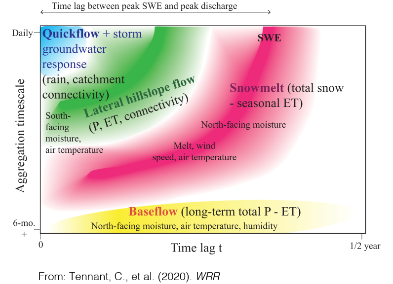

 
 
 
 

# Research
 
 
 
 
 
 
 

## Overview
********

##### As water flows across and through our landscapes, the timing, frequency and magnitude of flow is often tightly linked to mobilization and processing of key water quality constiuents such as nutrients and metals. I use a mixture of laboratory, field, and modeling approaches to identify, quantify, and understand these linkages in natural and managed landscapes. My research aims to further our understanding of hydrologic systems while helping to better manage precious resources. My research is broadly aimed at addressing the following questions:

* ##### What are the physical, geochemical, and biological factors that control water quality in freshwater systems?

* ##### When, where and how are materials transferred between groundwater and surface water systems?

* ##### What can data synthesis tell us about how the answers to these questions change across climate, land use and lithological gradients?

 
 
 

## Current Projects
********
### Using data-driven methods to understand watershed function

##### How long does it take for stream flow to peak after it rains? When do solute concentrations return to baseline after an event? These time scales are non-stationary, depend on antecedent conditions, and vary based on watershed characteristics such as lithology, land use, and climate. Traditional processed-based models often struggle to describe these time scales accurately because of data requirements or the need to define functional relationships. We are using data-driven methods from information theory such as transfer entropy and mutual information to infer the timing and relationships between key variables in hydrologic systems. Additionally, we are using deep learning methods such as Long Short Term Memory (LSTMs) to develop predictive hydrologic and hydrochemical models that are flexible and adaptable to many different watersheds. 

 
 

### Concentration-discharge relationships with high-frequency water quality time series

##### In agricultural watersheds excess nutrients can pose significant threats to local and regional water quality. The timing and magnitude of nutrient mobilization in these watersheds are driven by a complex combination of anthropogenic, hydrologic, and biogeochemical factors that operate across a range of spatial and temporal scales. We are analyzing data from recently deployed high-frequency, in-situ water quality sensors to better understand water quality dynamics at annual, seasonal, and individual event time scales. The tendency for a watershed to store or transmit solutes and nutrients across these time scales can be characterized by the relationship between concentration (c) and discharge (Q). Using publicly available data, we are compiling a database of c-Q relationships at various spatial and temporal scales to better understand how these dynamics can serve as a window into hydrologic and biogeochemical processes across landscapes.

###### **Gorski G.**, Zimmer M. (Accepted with minor revisions) Hydrologic regimes drive nitrate export in human impacted watersheds. *Hydrology and Earth System Science* [[_link to preprint_](https://hess.copernicus.org/preprints/hess-2020-562/)]

 
 

### Developing landscape scale models using experimental data

##### Denitrification (and other biogeochemical processes) vary from site to site based on a host of factors including soil grain size, available organic carbon, precipiation, climate, water chemistry, microbial community structure and many others. This makes it difficult to develop process-based models that are robust at scales larger than a field site, as these factors have considerable spatial variability. To address this, we leverage the measurements that we have collected at multiple field sites to develop a modeling framework that combines a process-based understanding with machine learning methods to understand how denitrification varies across landscapes under varying climatic conditions. 

###### **Gorski G.,** Fisher A.T., Beganskas S., Dailey H., Schmidt C. (In Review) Mapping the potential for denitrification during infiltration with machine learning informed by field and laboratory experiments. *Environmental Science and Technology*

###### **Gorski G.,** Fisher A.T., Beganskas S., Schmidt C., Dailey H. Characterizing spatial variability in denitrification potential under heterogeneous land use and precipitation patterns. *Poster presentation at AGU Fall Meeting 2019* [[_pdf_](files/AGU_2019_Poster.png)]

###### **Gorski G.,** Fisher A.T., Beganskas S., Schmidt C., Dailey H. Using machine learning to incorporate potential water quality improvements for mapping MAR suitability. *Oral presentation at the International Symposium for Managed Aquifer Recharge* (Madrid, Spain May 2019) [[_pdf_](files/Gorski_ISMAR_DenitMapping_Presentation.pdf)]

 
 

### Measuring denitrification during managed aquifer recharge

##### Managed aquifer recharge (MAR) is a common technique for augmenting groundwater supplies, but it is important to ensure that the water used for infiltration doesn't harm ambient groundwater quality. Under certain conditions, contaminants such as nitrate (NO~3~) can be removed as water infiltrates through shallow soils during MAR via a process called denitrification. Through lab, field, and modeling studies we are investigating how controlling factors such as infiltration rate and the amount of labile carbon can affect denitrification during infiltration. 

###### **Gorski G.**, Dailey H., Fisher A.T., Schrad N., Saltikov C. (2020) Denitrification during infiltration for managed aquifer recharge: Infiltration rate controls and microbial response. *Science of the Total Environment* [[_link_](https://authors.elsevier.com/a/1axrvB8ccoDOo)]

###### **Gorski G.**, Fisher A.T., Beganskas S., Weir W., Redford K., Schmidt C., Saltikov C. (2019) Field and laboratory studies linking hydrologic, geochemical, and microbiological processes and enhanced denitrification during infiltration for managed recharge. *Environmental Science and Technology* [[_pdf_](files/Gorski_EST_2019.pdf)][[_link_](https://pubs.acs.org/doi/10.1021/acs.est.9b01191)]

###### Beganskas S., **Gorski G.**,Weathers T., Fisher A.T., Schmidt C., Saltikov C.W., Redford K., Stoneburner B., Harmon R., Weir W. (2018) A horizontal permeable reactive barrier stimulates nitrate removal and shifts microbial ecology during rapid infiltration for managed recharge. *Water Research* [[_pdf_](files/Beganskas_WR_2019.pdf)][[_link_](https://doi.org/10.1016/j.watres.2018.07.039)]

 
 
 

## Past Projects
********

### Groundwater recharge suitability mapping in the MENA region

##### In an effort to increase their water security, many countries in arid regions of the world such as the Middle East and North Africa (MENA) are implementing projects to increase groundwater supply and storage. I have been working as a NSF-GRIP intern with an international team from Jordan, Lebanon, Egypt, the Netherlands and the USA (USGS) to develop regional suitability maps to highlight promising locations for managed recharge projects. The maps take into account various physical, climatic and socio-economic parameters which are aggregated and weighted based on local proirities to create a composite suitability map. As part of this effort, I have developed a web application to produce suitability maps which allows the user to adjust the weights and aggregating schemes and see the results in real time.

##### The tool is called **M**ulti-factor **A**nalysis for **R**echarge **Map**ping **S**uitability (MARMapS) -- [_https://ggorski.shinyapps.io/marmaps/_](https://ggorski.shinyapps.io/marmaps/) a simplified version of the app [_can be found here_](https://ggorski.shinyapps.io/jordan_marmaps/)

##### More information can be found on [_my github page_](https://github.com/galengorski/MARMapS)

###### **Gorski G.,** van der Valk, M. Producing more interpretable maps of managed aquifer recharge suitability by visualizing sensitivity to subjective choices during mapmaking.*Oral presentation at the International Symposium for Managed Aquifer Recharge* (Madrid, Spain May 2019) [[_pdf_](files/ISMAR_AppPresentation.pdf)] 

 
 

### Water vapor isotopes

##### Several independent lines of evidence suggest an intensification of the hydrologic cycle due to climate change. Stable isotopes of water vapor provide a unique window into perturbations of the hydrologic cycle on various time scales. Records of water vapor isotopes can be used to quantify fluxes and partition hydrologic feedbacks between the atmosphere and the land surface. I helped collect a high-resolution record of water vapor isotope measurements in Salt Lake City, Utah that revealed the build-up of fossil fuel-derived water vapor during times of atmospheric inversion when CO2 concentrations peaked.  Modeling suggested that up to 13% of the atmospheric moisture during these periods was from fossil fuel-derived water vapor, a huge source!

###### **Gorski G.**, Strong C., Good S.P., Bares R., Ehleringer J.R., Bowen G.J. (2015) Vapor hydrogen and oxygen isotopes reflect water of combustion in the urban atmosphere. *Proceedings of the National Academy of Sciences* [[_link_](https://www.pnas.org/content/112/11/3247)]

Related:

###### Griffis T.J., Wood J.D., Baker J.M., Lee X., Xiao K., Chen Z., Welp L.R., Schultz N.M., **Gorski G.**, Chen M., Nieber J., (2016) Investigating the source, transport, and isotope composition of water vapor in the planetary boundary layer. *Atmospheric Chemistry and Physics Discussion* [[_link_](https://acp.copernicus.org/articles/16/5139/2016/)]

 

