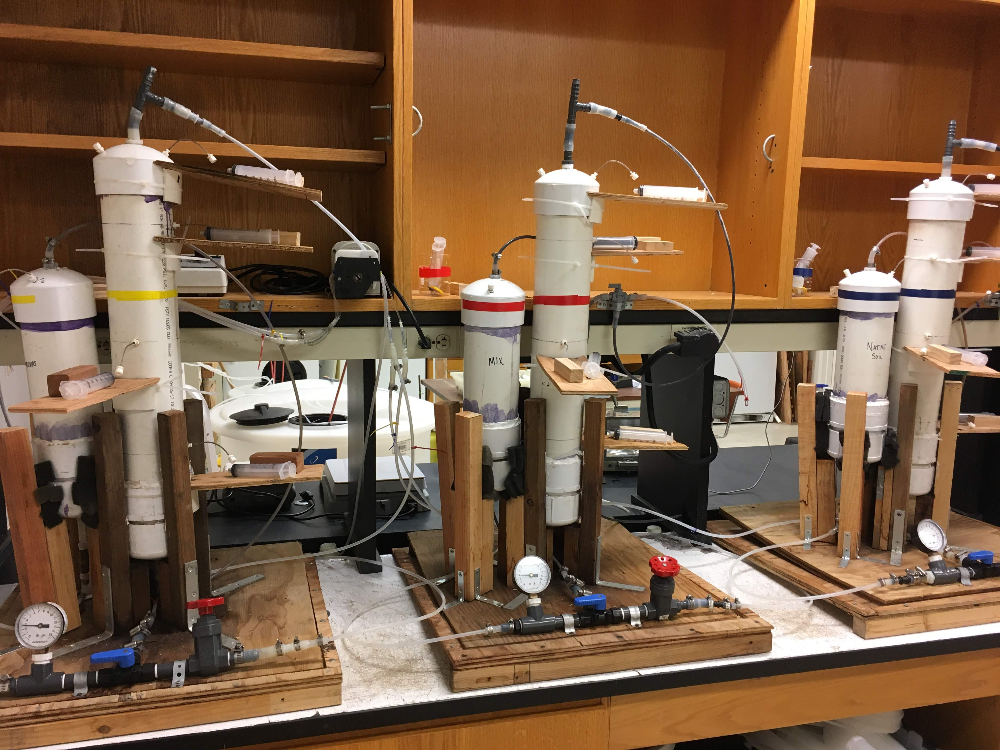
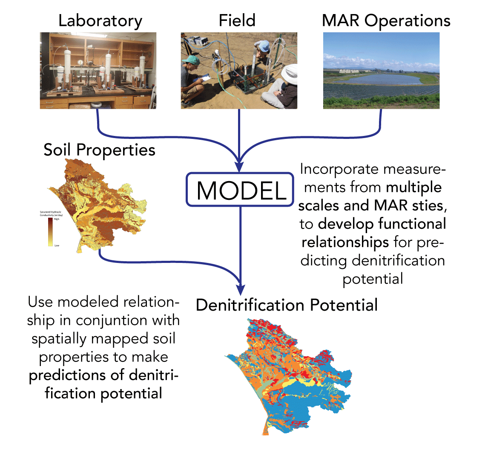

 
 
 

# Research
 
 
 
 
 
 
 

---

##### Managed aquifer recharge (MAR) is an common technique for augmenting groundwater supplies, but it is important to ensure that the water used for infiltration doesn't harm ambient groundwater quality. Under certain conditions, contaminants such as nitrate (NO~3~) can be removed as water infiltrates through shallow soils during MAR via a process called denitrification. We are investigating how denitrification can be enhanced during MAR by placing carbon-rich materials such as woodchips or biochar in the path of infiltrating water to stimulate microbial activity and create conditions that encourage denitrification. Understanding these dynamics better, leads to techniques that can improve water quality and quantity simultaneously. For more information see our recent publication [_Beganskas et al 2018_](files/Beganskas_WR_2019.pdf)

 
 

##### A key control on denitrification (and other biogeochemcial processes) during managed aquifer recharge (MAR) is the rate of infiltration. In the field the infiltration rate is determined by soil properties, but in the lab we can more easily manipulate it and measure the effects. This allows us to better understand how denitrification might vary across sites with different conditions. We have collected intact soil cores from several MAR sites, amended them with carbon sources such as woodchips and pumped artificial groundwater through them at various rates measuring the geochemical and microbiological response to better understand the controlling factors of denitrification during infiltration.  

 
 

##### Managed aquifer recharge (MAR) is an common technique for augmenting groundwater supplies, but it is important to ensure that the water used for infiltration doesn't harm ambient groundwater quality. Under certain conditions, contaminants such as nitrate (NO~3~) can be removed as water infiltrates through shallow soils during MAR via a process called denitrification. Through lab, field, and modeling studies we are investigating how controlling factors such as infiltration rate and the amount of labile carbon can affect denitrification during infiltration. For more information see our recent publication [_Beganskas et al 2018_](files/Beganskas_WR_2019.pdf) more to come soon!

