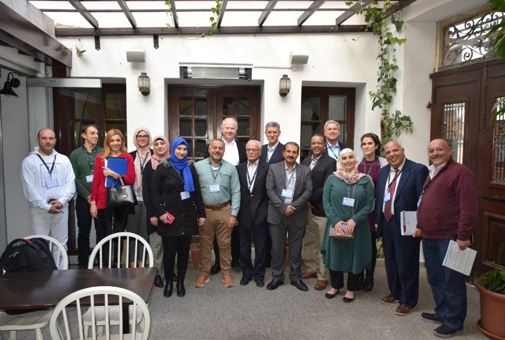

<br>
<br>
<br>
<br>

# Updates

<br>
<br>
<br>
<br>
<br>
<br>
<br>


---
## 9/12/2019


#### I submitted a proposal for the NSF post-doctoral scholarship. It's a long shot but I think the project would be pretty cool. I proposed to work with Ben Bostick of Columbia University and Melinda Erickson of University of Minnesota to compare patterns and variability in arsenic contamination in Vietnam and Minnesota using some geophysical methods and a global dataset of groundwater arsenic concentrations.


<br>
<br>
<br>
<br>


## 8/24/2019

#### I just got back from a few weeks visiting [_Rachel Lauer_](https://www.lauer-geofluids.xyz) and her lab group at the University of Calgary. I went up to see how they were using near-surface geophysical techniques in groundwater studies, and to try and learn some methods that could be useful to our work in California. Her lab has a bunch of really cool projects in some beautiful locations!

```{r echo=FALSE, out.width="80%", fig.align='center', fig.cap='Upperleft: ERT lines collected to image soap hole plumbing. Lowerleft: CO2 injection site near Brooks, AB where U Calgary runs its geophysics field school. Right: PhD candidate Tom Wilson sampling geothermal water in Banff National Park. The white stuff is algae!'}
knitr::include_graphics("images/CanadaImages.gif")
```

<br>
<br>


## 7/29/2019


#### Check out our [_new paper_](files/Gorski_EST_2019.pdf) looking at denitrification during infiltration. Using a combination of field and lab studies we examine how flow rate and different soil amendments affect denitrification. This has implications for how managed aquifer recharge systems could be built and operated to improve water quality. 

<br>
<br>

## 6/22/2019

#### With a team of graduate students and professors, helped [_Andria Green_](https://andigreene.weebly.com/) construct boardwalks in Elkhorn Slough. She will be studying nitrogen cycling dynamics in various tidally influenced areas of slough.

<br>
<br>

## 6/13/2019

#### Finished TAing ESCI100, Intro to Environmental Systems, a calculus based modeling class looking at budgets and environmental processes. We only had four students, so they each got a lot of attention.

<br>
<br>

## 5/24/2019

#### Gave two talks at the Internationl Symposium for Managed Aquifer Recharge in Madrid. One talk was focused mapping denitrification across landscapes ([_slides here_](files/ISMAR_DenitMapping_Presentation.pdf)) and the other talk was on the recharge suitability web application that I developed ([_slides here_](files/ISMAR_AppPresentation.pdf)). The conference was very international, and it was exciting to see MAR projects from all over the world. It was also held in an old elevator factory!

```{r echo=FALSE, out.width="50%", fig.align='center'}
knitr::include_graphics("images/ISMAR_2019.JPG")
```
<br>
<br>

## 2/5/2019

#### Attending a workshop in Nicosia, Cyprus with regional collaborators to help develop maps and modeling products for groundwater recharge suitability in the Middle East and North Africa. The workshop was part of a larger collaboration between US-AID, USGS, and the countries of Jordan, Lebanon, Palestine and other regional partners. Energizing to talk to folks from other parts of the world interested in similar topics!

```{r echo=FALSE, out.width="50%", fig.align='center'}

```
