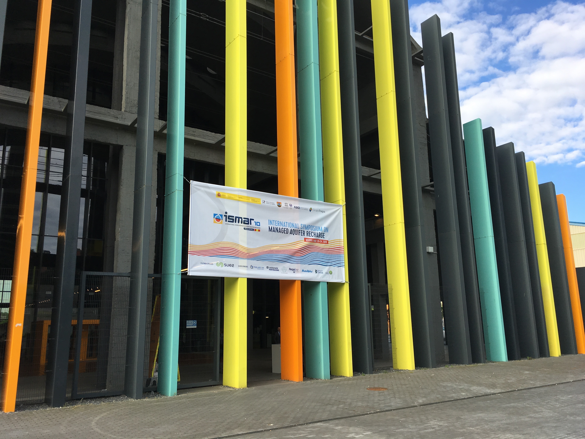

<br>
<br>
<br>
<br>

# Updates

<br>
<br>
<br>
<br>
<br>
<br>
<br>


---


## 4/14/2020


#### Check out our [_new paper_](https://authors.elsevier.com/a/1axrvB8ccoDOo) that was just published in Science of the Total Environnment looking at the infiltration rate controls on denitrification during infiltration. We designed a way to collect intact sediment cores and pump artificial groundwater through them in the lab. Then we measured the changes in nitrate and carbon as water flowed through the soils at different rates. We also looked at the response from the soil microbial populations and it was a surpringly strong signal. Then, we added woodchips to see if that would jump start the denitrification process and it did! Results from this study and others like it are helping to develop technologies to improve groundwater quality through the use of managed aquifer recharge.

<br>
<br>
<br>
<br>


## 3/2/2020


#### As of the end of February Santa Cruz has received 4,280 mm of precipitation in water year 2020, that's just 75% of our average annual value up to that date. In Santa Cruz, January and February are generally our wettest months accounting for almost 40% of the annual rainfall on average. February was really dry (and beautiful), making it feel like it has been a particularly dry year overall, but I think this might just be a function of recency bias. January was a little below average for the area, and December was anomalously wet. In places like California, where extremes in precipitation are the expectation, it can be hard to gauge how far we've deviated from the norm without looking at the numbers. Global climate models can't seem to agree on where we will see increases and decreases in overall precipiation with climate change, but there is concensus that intensity and variability of hydrologic extremes will continue to increase. 

<br>
<br>
<br>
<br>


## 1/20/2020


#### As a part of the NSF-funded Graduate Research Internship Program (GRIP), I have been participating in an internship project that is a collaboration between the USGS, US-AID, and the governments of Lebanon and Jordan. The project aims to select sites for development of aquifer storage and recovery projects in an effort to increase water security in the region. As part of the project, I have developed a site suitability mapping application called MARMapS, that helps facilitate the creation of multi-factor suitability maps. I published it online at [_https://ggorski.shinyapps.io/marmaps/_](https://ggorski.shinyapps.io/marmaps/), check it out and play around with it. The code and user tutorials can be found on my [_github page_](https://github.com/galengorski/MARMapS).


<br>
<br>
<br>
<br>


## 12/10/2019


#### AGU was back in San Francisco this year, and I presented a poster based on the third chapter of my thesis entitled *Characterizing spatial variability in denitrification potential during infiltration under heterogeneous landuse and precipitation patterns*. [_See the poster here_](files/AGU_2019_Poster.png). There were also great posters from [_Jenny Pensky_](https://agu.confex.com/agu/fm19/meetingapp.cgi/Paper/544063) and [_Araceli Serrano_](https://agu.confex.com/agu/fm19/meetingapp.cgi/Paper/590977) that focused on changes in water quality during infiltration for managed recharge.


<br>
<br>
<br>
<br>


## 10/13/2019


#### Along with a team from the Hydrogeology group including [_Adam Price_](https://adamnicholasprice.github.io/), Victor Bautista, Andrew Fisher and Jenny Pensky, I spent the day at a vineyard near Sacremento, CA. The vineyard is a site selected for one of the first flood managed aquifer recharge (F-MAR) projects in the region. During the rainy season about 1000 acres of the vineyard will be flooded with excess flows from the nearby Consumnes River in an effort to recharge the underlying aquifers. It's the first project of its scale in the area, and if it's succsessful, there are likley to be many more like it in the future. Led by Jenny (at the top of the ladder), we helped collect sediment cores that she will analyze and conduct experiments on to investigate changes in fluid geochemistry during infiltration.


<br>
<br>
<br>
<br>


## 9/12/2019


#### I submitted a proposal for the NSF post-doctoral scholarship. It's a long shot but I think the project would be pretty cool. I proposed to work with Ben Bostick of Columbia University and Melinda Erickson of University of Minnesota to compare patterns and variability in arsenic contamination in Vietnam and Minnesota using some geophysical methods and a global dataset of groundwater arsenic concentrations.


<br>
<br>
<br>
<br>


## 8/24/2019

#### I just got back from a few weeks visiting [_Rachel Lauer_](https://www.lauer-geofluids.xyz) and her lab group at the University of Calgary. I went up to see how they were using near-surface geophysical techniques in groundwater studies, and to try and learn some methods that could be useful to our work in California. Her lab has a bunch of really cool projects in some beautiful locations!

```{r echo=FALSE, out.width="80%", fig.align='center', fig.cap='Upperleft: ERT lines collected to image soap hole plumbing. Lowerleft: CO2 injection site near Brooks, AB where U Calgary runs its geophysics field school. Right: PhD student Tom Wilson sampling geothermal water in Banff National Park. The white stuff is algea!'}
knitr::include_graphics("images/CanadaImages.gif")
```

<br>
<br>


## 7/29/2019


#### Check out our [_new paper_](files/Gorski_EST_2019.pdf) looking at denitrification during infiltration. Using a combination of field and lab studies we examine how flow rate and different soil amendments affect denitrification. This has implications for how managed aquifer recharge systems could be built and operated to improve water quality. 

<br>
<br>

## 6/22/2019

#### With a team of grad students and professors, helped [_Andria Green_](https://andigreene.weebly.com/) construct boardwalks in Elkhorn Slough. She will be studying nitrogen cycling dynamics in various tidally influenced areas of slough.

<br>
<br>

## 6/13/2019

#### Finished TAing ESCI100, Intro to Environmental Systems, a calculus based modeling class looking at budgets and environmental processes. We only had four students, so they each got a lot of attention.

<br>
<br>

## 5/24/2019

#### Gave two talks at the Internationl Symposium for Managed Aquifer Recharge in Madrid. One talk was focused mapping denitrification across landscapes ([_slides here_](files/ISMAR_DenitMapping_Presentation.pdf)) and the other talk was on the recharge suitability web application that I developed ([_slides here_](files/ISMAR_AppPresentation.pdf)). The conference was very international, and it was exciting to see MAR projects from all over the world. It was also held in an old elevator factory!

```{r echo=FALSE, out.width="50%", fig.align='center'}

```
<br>
<br>

## 2/5/2019

#### Attending a workshop in Nicosia, Cyprus with regional collaborators to help develop maps and modeling products for groundwater recharge suitability in the Middle East and North Africa. The workshop was part of a larger collaboration between US-AID, USGS, and the countries of Jordan, Lebanon, Palestine and other regional partners. Energizing to talk to folks from other parts of the world interested in similar topics!

```{r echo=FALSE, out.width="50%", fig.align='center'}
knitr::include_graphics("images/CyprusWorkshop.png")
```