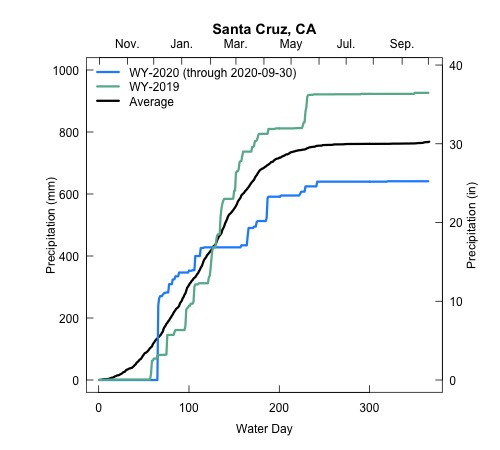
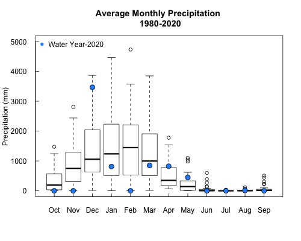

 
 
 
 

# Water conditions in Santa Cruz

 
 
 
 
 
 
 

### This page is under construction and there is more to come

---

 
 
 
 

#### In many parts of the world water accounting is done based on the Water Year and not the traditional calendar year. The Water Year begins on October 1st and extends to September 30th of the next year. The plots to the right show the cumulative amount of precipitation in Santa Cruz, California during Water Year 2020 (which began on 10-01-2019). They also show Water Year 2019 and the average of Water Years from 1980-2020. These plots will be continually updated throughtout the year to show how our current Water Year is tracking with the historical record!

 
 
 
 
 

 
 

#### Average monthly precipitation totals for Santa Cruz from 1980-2020, with Water Year 2020 shown in blue circles. This year has been one of extremes, with December a near record wet month and February a near record dry one. Such is life in California, where extremes are the norm! Find the code for these plots [_here_](precip_plotting.html)